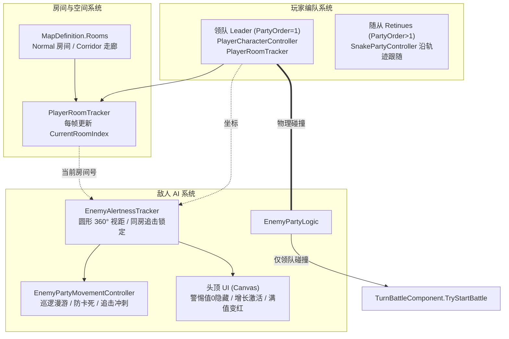

# 探索层与敌人 AI 技术文档

> 对应设计文档：`Docs/GameDesign/03_RunExploration.md`  
> 核心程序集：`SepCore.Runtime`、`SepCore.Base`

---

## 1. 探索层架构总览

探索层由**玩家编队**、**房间空间定位**与**敌人 AI 实体**三大核心子系统协作构成：



---

## 2. 房间与区域定位 (Room Tracking)

- **房间数据定义 (`RoomDefinition`)**：
  - 属性：`PointA`, `PointB`, `RoomType`（`Normal` 普通房间 / `Corridor` 走廊）；
  - `Min` / `Max` / `Center` / `Size`：根据 A、B 对角点自动计算矩形包围盒；
  - `Contains(Vector2/Vector3)`：高效的 AABB 包含判定。
- **走廊定义 (`RoomType.Corridor`)**：
  - 走廊在数据结构上完全按房间统一管理，但不刷新任何敌人与物资点；
  - 为未来迷雾系统（Fog of War）提供区域显露的底层粒度支持。
- **领队房间追踪 (`PlayerRoomTracker`)**：
  - 领队在 `OnShow` 后通过 `InitializeRoomTracker(buildResult.Rooms)` 挂载；
  - 每帧在 `OnUpdate` 中检测当前坐标所在的房间索引，提供 `CurrentRoomIndex` 属性供全探索层查询；
  - 跨房时对外抛出 `PlayerEnterRoomEventArgs` 与 `PlayerExitRoomEventArgs`。

---

## 3. 敌人 AI 与警惕视距 (Enemy Alertness & Detection)

由 `EnemyAlertnessTracker` 负责纯逻辑计算，脱离 MonoBehaviour 即可独立执行 EditMode 单元测试。

- **圆形 360° 全向视距**：
  - 2D 顶视角单贴图角色缺乏朝向感知表现，统一移除面向角度限制，采用纯欧氏距离 `(playerPos - enemyPos).magnitude <= MaxViewDistance` 进行判定；
  - 处于视距内时，按距离分段增长警惕值（`GetGrowthRate(distance)`），距离越近增长越快。
- **满警惕同房间追击锁定**：
  - 警惕值达到 `AlertMax`（默认 1000）后进入 `Pursuit`（追击状态）；
  - **锁定规则**：只要玩家与敌人在同一个房间（`playerRoomIndex == enemyRoomIndex`），敌人无视玩家是否拉开超视距，持续锁定追击，警惕值保持满值，丢失倒计时归零。
- **跨房脱战与丢失目标**：
  - 当玩家跨出房间（进入走廊或其他房间）后，追击状态断开，切入 `LostTarget` 状态；
  - `LostTarget` 期间敌人停止移动，并累计脱战计时；超过 3 秒后彻底脱战，重置回 `Patrol` 状态并在房间内恢复巡逻。
- **逃跑保护抑制**：
  - 逃跑后激活 `EscapeProtectionActive`（2 秒）；
  - 保护期内敌人视线完全阻断，警惕值仅衰减不增长，追击状态立即被打断进入脱战倒计时。

---

## 4. 巡逻漫游与防卡死机制 (Patrol & Anti-Stuck)

由 `EnemyPartyMovementController` 驱动，解决 2D 实体碰撞环境下的巡逻平滑性与卡死问题：

1. **安全内缩安全距 (Padding >= 1.2m)**：
   - 敌人 Prefab 上的 `BoxCollider2D` 尺寸为 1.0m × 1.0m（半宽 0.5m）；
   - 挑选随机目标点时留足 1.2m 以上的内缩距，杜绝将目标点选在房间外墙碰撞体内。
2. **有效位移选点**：
   - 选点时优先挑选距离当前坐标 `>= 1.5m` 的目标点（最多尝试 6 次），避免频繁原地选点造成无休止的原地停顿。
3. **单段巡逻超时 (5.0s)**：
   - 单段移动累计耗时超过 5 秒未到达，主动放弃当前目标并进入 1.0~2.2 秒随机等待停顿后重新选点。
4. **防卡死检测与自恢复 (0.8s / 位移 < 0.08m)**：
   - 移动过程中每 0.8 秒检查一次实际位移；若位移小于 0.08 米（被墙体、内部障碍物或同伴阻挡），判定为卡死；
   - 立刻触发 0.5~1.0 秒短暂停顿并重新挑选目标点转身离开。
5. **物理帧同步与边界约束**：
   - 在 `FixedUpdate` 持续同步 `_rigidbody2D.velocity = _currentVelocity`，并在巡逻和追击中施加统一的房间边界 Margin 约束，防止刚体朝外挤穿墙体。

---

## 5. 碰撞进战门禁 (Combat Collision Rule - Scheme B)

- **入口**：`EnemyPartyLogic.HandleCollision(GameObject other)`。
- **领队过滤**：
  ```csharp
  PlayerCharacterLogic player = other.GetComponentInParent<PlayerCharacterLogic>() ?? other.GetComponent<PlayerCharacterLogic>();
  if (player == null || !player.IsLeader)
  {
      return;
  }
  ```
- **机制效果**：
  - 随从队员（`PartyOrder > 1`）即便被敌人追上撞到，直接忽略物理碰撞，不触发战斗；
  - 只有领队（`PartyOrder == 1`）发生碰撞时才触发进战；
  - 根据警惕值是否满值判定遭遇类型：
    - `!_alertnessTracker.IsAlertFull` -> 先制战斗（首轮全员先攻）；
    - 警惕值已满 -> 普通战斗。

---

## 6. 头顶警惕 UI (Alert UI Lifecycle)

- **层级结构**：
  - 敌人实体 Prefab 下挂载独立的 World Space `Canvas`，子节点包含背景图 `bg` 与警惕进度图 `alert`。
- **显隐状态机**：
  - **警惕值 == 0**：调用 `Canvas.SetActive(false)`，彻底隐藏整个头顶 UI，在场景中完全不显示任何空进度环；
  - **警惕值 > 0**：自动调用 `Canvas.SetActive(true)` 激活显示，并按比例设置 `Image.fillAmount`（0 ~ 1）；
  - **满警惕**：`Image.color` 切换为红色（`FullAlertColor`）；未满为默认白色（`NormalAlertColor`）；
  - **衰减归零 / 脱战**：警惕值衰减归零瞬间重新调用 `SetActive(false)` 自动隐藏。
