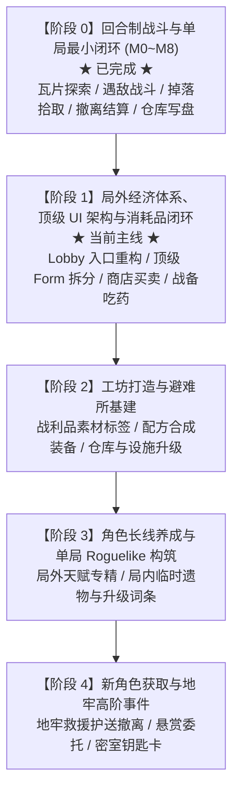

# SBE 开发路线与技术 TODO

> 状态：阶段 0（回合制战斗与单局最小闭环）已全面完成并归档；阶段 1（局外经济体系、顶级 UI 架构与消耗品闭环）推进中。
>
> 更新日期：2026-09-12
>
> 相关设计：`Docs/GameDesign/` 全部文档、`Docs/Tech/01_LubanDataTable.md`、`Docs/Tech/02_SaveData.md`、`Docs/Tech/03_UIMaintenance.md`。

---

## 一、总体研发演进路线（Roadmap）

本项目采用“单局核心闭环 → 局外经济与消耗出口 → 长线养成与构筑 → 高阶机制与元游戏”的递进路线：

| 阶段 | 核心目标 | 关键成果 | 当前状态 |
| :--- | :--- | :--- | :--- |
| **阶段 0** | 回合制战斗与单局最小闭环 | 4v4 调度、先制、技能/状态/逃跑、地图遭遇、掉落与主仓库结算 | **[x] 已完成** |
| **阶段 1** | 局外经济、顶级 UI 与消耗品 | 顶级 UI 架构解耦、ShopForm 双栏买卖、战利品变现、药品局内使用 | **[ ] 进行中（当前主线）** |
| **阶段 2** | 工坊打造与避难所基建 | 战利品素材化、装备配方打造、避难所设施与仓库容量扩建 | [ ] 待开始 |
| **阶段 3** | 角色长线养成与单局构筑 | 局外角色专属天赋/技能分支装配、单局临时遗物与经验词条 | [ ] 待开始 |
| **阶段 4** | 新角色获取与高阶机制 | 地牢遇险 NPC 救援护送撤离解锁、悬赏声望体系、钥匙卡密室 | [ ] 待开始 |

---

## 二、大厅顶级 UI 架构与入口规范

### 2.1 架构原则：告别单一大厅嵌套，全面拥抱顶级 Form

- **解耦“容器”与“功能视图”**：不将所有系统强塞在 `LobbyForm` 内作为子 View 切换，避免 `LobbyForm` 成为巨石上帝类。
- **专有布局（Contextual Layout）**：每个核心系统拥有完全独立的 16:9 全屏或专有布局，不再受制于原大厅左侧死板的嵌套容器。
- **遵循 UGF 生命周期规范**：顶级 Form 拥有原生 `OnInit / OnOpen / OnClose` 生命周期，彻底杜绝嵌套 Form 事件漏绑或手动调用的隐患（参见 `Docs/Tech/03_UIMaintenance.md`）。

### 2.2 大厅需要承载的顶级 UI 列表

| 顶级 UI | 职责与交互心智 | 推荐布局模型 |
| :--- | :--- | :--- |
| **战备出征 (`DeploymentForm`)** | 出战人员配置 (Squad)、携带物资配置 (Loadout)、难度与随机种子选择、一键出击 | **作战沙盘台**：中央出战队员立绘/站位，右侧难度与种子面板，底部显目 **[BEGIN RUN]** |
| **特勤整备 (`CharacterForm`)** | 角色列表选择、武器与防具穿脱与替换、属性变化即时对比、技能与天赋查看 | **三栏式**：左侧角色列表，中间武器/防具槽与随身背包，右侧数值与技能面板 |
| **后勤商贸 (`ShopForm`)** | 消耗品/药品购买、基础装备补充；仓库战利品变现出售；一键出售全部战利品 | **双栏买卖式**：左侧商人货架（分类筛选与购买），右侧玩家仓库（快速点击出售），顶部常驻金币 |
| **基地仓库 (`WarehouseForm`)** | 全局大仓库物资盘点、多品类标签筛选、批量整理与丢弃/锁定 | **全宽大网格**：大面积物品槽，顶部装备/消耗品/材料/战利品筛选器，悬浮详情卡 |
| **工程工坊 (`WorkbenchForm`)** *(阶段 2)* | 战利品材料合成装备、避难所设施升级（扩仓、强化回血） | **树状配方工坊**：左侧可制造配方列表，右侧素材消耗与属性预览 |
| **行动档案 (`ArchiveForm`)** *(后续可选)* | 历史结算记录 (`RunRecord[]`)、撤离统计、怪物与图鉴 | **列表与卡片**：历史战绩图表展示 |

### 2.3 `LobbyForm` 的定位与留出的入口按钮

`LobbyForm` 转型为**大厅行动指挥中枢（Command Hub）**：
- **常驻入口按钮区**（可采用顶部全局导航栏 Top Bar 或中枢卡片导航）：
  1. `EXPEDITION`（战备出征）→ 打开 `DeploymentForm`
  2. `ROSTER`（特勤整备）→ 打开 `CharacterForm`
  3. `SUPPLY`（后勤商贸）→ 打开 `ShopForm`
  4. `WAREHOUSE`（基地仓库）→ 打开 `WarehouseForm`
  5. `WORKBENCH`（工程工坊）→ *(阶段 2 预留入口，前期可置灰)*
- **常驻信息区（Top Bar / Header）**：
  - 全局通货/信用点显示：`[Coin Icon] 12,500`
  - 存档状态标识：`LOCAL SAVE: READY`
  - 设置与退出游戏按钮

---

## 三、当前主线：阶段 1 详细里程碑

> 目标：实现顶级 UI 架构拆分、局外买卖经济闭环、战备药品局内使用，形成完整的“搜刮变现-补给-再战”闭环。

### [ ] P1-M1 大厅顶级 UI 架构解耦与入口重构
- **目标**：将原本嵌套在 LobbyForm 下的子面板拆分为独立顶级 Form，重构 Lobby 入口导航。
- **范围**：
  - 在 `UIFormConfig.xlsx` 中为 `DeploymentForm`、`ShopForm` 等正式注册独立 Form ID。
  - `LobbyForm` 改造为指挥中枢，保留 `Expedition`、`Roster`、`Supply`、`Warehouse` 核心入口按钮。
  - 统一顶级 Form 打开/关闭生命周期与返回机制（ESC / 返回按钮回到大厅）。
  - 右上角常驻资产栏显示（金币与存档状态）。

### [ ] P1-M2 经济系统与数据结构扩展
- **目标**：完善局外货币持久化与配表买卖价格。
- **范围**：
  - `SaveData` 增加 `gold / credits` 字段（`int` 或 `long`），支持序列化与反序列化，新存档提供初始启动资金。
  - `ItemConfig.xlsx` 增加 `SellPrice`（基础出售价）、`BuyPrice`（商人出售价，0 为不可购买）字段。
  - 运行 `gen_cli.bat` 导出最新 Luban 数据与代码。
  - 提供 `EconomyComponent` 或在 `SaveComponent` 中封装货币变动安全接口与日志。

### [ ] P1-M3 双栏商贸补给界面（ShopForm）
- **目标**：实现商人货架购买与仓库战利品变现的一站式交易界面。
- **范围**：
  - 新建 `ShopForm`：左侧货架展示可购买商品（治疗药水、魔力药水、基础装备），右侧展示玩家主仓库。
  - 实现货架商品购买：扣除金币、物品存入主仓库、容量上限检查。
  - 实现仓库物品出售：单件出售确认、战利品一键变现（自动扫描非装备/非药品物品并批量出售）。
  - 金币变化平滑刷新与音效/文案反馈。

### [ ] P1-M4 消耗品局内使用与战备携带循环
- **目标**：让买到的药品能够带入局内并在探索中实际生效，形成闭环。
- **范围**：
  - `Loadout` 携带消耗品进入地图并填充至局内共享背包。
  - 在局内背包界面（`RoundBackpackForm`）或 HUD 快捷栏支持右键/点击“使用”消耗品。
  - 治疗药水恢复出战角色 HP（不超过上限），魔力药水恢复 MP。
  - 消耗品使用后数量减 1，减至 0 时移除堆叠。

---

## 四、后续阶段规划（阶段 2 ~ 阶段 4）

### 阶段 2：工坊打造与避难所基建
- **P2-M1 战利品素材化**：`ItemConfig` 划分细分子类型（`Material` 金属、电路板、生物组织等）。
- **P2-M2 装备配方打造**：新增 `CraftingConfig`，在 `WorkbenchForm` 中消耗指定素材打造高阶武器与防具。
- **P2-M3 避难所基建升级**：消耗大宗战利品升级主仓库格数、避难所医疗站（局内初始微量回血加成）。

### 阶段 3：角色长线养成与单局 Roguelike 构筑
- **P3-M1 局外天赋专精**：出战或撤离结算获取角色经验，在 `CharacterForm` 中解锁被动特质或新技能。
- **P3-M2 单局临时遗物（Relics/Chips）**：局内地牢掉落战术芯片，仅在本局提供战斗特效（暴击回蓝、濒死加速等）。
- **P3-M3 单局经验与升级词条**：地牢内击怪升级，提供单局属性/技能强化三选一。

### 阶段 4：新角色获取与地牢高阶事件
- **P4-M1 地牢救援护送撤离**：中高难度地图中生成受困 NPC，解救后作为残血队友护送至撤离点，成功撤离永久解锁新角色。
- **P4-M2 悬赏与阵营委托**：商人发布材料收集订单，交付换取专属信物与折扣。
- **P4-M3 钥匙卡与密室**：红/蓝钥匙卡开启高阶密室高倍率物资箱。

---

## 五、历史归档：阶段 0 回合制战斗原型（已完成）

> 阶段 0 回合制战斗体系开发已全面完成并通过验证，相关契约与验收记录归档如下，作为底层战斗内核的既定标准。

### 5.1 架构与边界规范
- **唯一外部入口**：`TurnBattleComponent` 是战斗生命周期的唯一所有者，负责开战校验、推进、暂停探索与单局状态回写。
- **独立纯逻辑内核**：`BattleRuntime` 不访问场景 GameObject、不访问 `SaveData`、不重新播种随机源。
- **单局临时状态隔离**：战斗只操作 `BattleUnit`，战后把 HP/MP 写回 `RunPlayerState`，死亡只留保险箱。

### 5.2 里程碑执行记录（M0 ~ M8 全部完成）

| 里程碑 | 内容 | 代码 | 编译与测试 | 状态 |
| :--- | :--- | :--- | :--- | :--- |
| **M0** | 战斗壳层与单局基础状态 | 已完成 | dotnet build 0 错误；Play Mode 壳层开关与暂停实测通过 | **[x] 已完成** |
| **M1** | 架构收敛与 1v1 攻击闭环 | 已完成 | EditMode 25 用例全过；Play Mode 1v1 伤害反击胜负实测通过 | **[x] 已完成** |
| **M2** | 4v4 调度、先制与确定性随机 | 已完成 | EditMode 35 用例全过；Play Mode 4v4 速度/先制排序实测通过 | **[x] 已完成** |
| **M3** | 技能、目标、MP 与数值效果 | 已完成 | EditMode 50 用例全过；Play Mode 二次确认与技能释放实测通过 | **[x] 已完成** |
| **M4** | 状态、眩晕与速度变化 | 已完成 | EditMode 60 用例全过；Play Mode 眩晕跳过与减速重排实测通过 | **[x] 已完成** |
| **M5** | 逃跑、结束矩阵与单局回写 | 已完成 | EditMode 77 用例全过；Play Mode 四种 Outcome 与 HP/MP 回写实测通过 | **[x] 已完成** |
| **M6** | 真实探索遭遇与地图恢复 | 已完成 | 碰撞进战、警惕先制、逃跑保护、胜利移除、掉落生成实测通过 | **[x] 已完成** |
| **M7** | 战斗 UI 与输入限制完成 | 已完成 | 多人状态栏、目标选中取消、战斗中背包显式门禁实测通过 | **[x] 已完成** |
| **M8** | 全量回归与原型完成 | 已完成 | 22 项设计验收全部闭环，最低测试矩阵全部留证 | **[x] 已完成** |

### 5.3 设计验收 22 条（全量通过）
- [x] 多个玩家和多个敌人可以同时参战。
- [x] 玩家与敌人上限均为 4，并按战备和敌人队伍预设创建。
- [x] 普通轮次每个单位只行动一次，每次行动后按当前速度决定下一位。
- [x] 同速玩家优先，速度变化立即影响尚未行动单位。
- [x] 同阵营同速按队伍顺序行动。
- [x] 死亡、眩晕或无法行动单位跳过本轮。
- [x] 轮到玩家角色时才显示并处理该角色的行动选择。
- [x] 先制第一轮所有玩家排在所有敌人之前。
- [x] 先制第二轮恢复普通速度规则。
- [x] 玩家可选择攻击、技能和逃跑，道具保留但首版不可用。
- [x] 战斗中不能打开共享背包或保险箱。
- [x] 敌人随机选择可用行动和合法目标。
- [x] 敌人全灭时胜利，玩家全灭时战斗和单局失败。
- [x] 单个角色可逃跑；只要有人逃跑，其他人阵亡不导致单局失败。
- [x] 逃跑使用配置成功率，失败后继续留在战斗。
- [x] 逃跑成功或失败均消耗本轮行动。
- [x] 逃跑返回战前位置并获得保护时间。
- [x] 逃跑者保留 HP/MP，部分失败中的阵亡者恢复 1/1。
- [x] 任何非全员阵亡结果中的阵亡角色恢复 1/1。
- [x] 逃跑后地图敌人恢复，重战按完整预设创建。
- [x] 保护期间不警惕、不追击、不触发战斗，结束仍重叠时可重入。
- [x] 战斗 UI 显示我方 HP/MP、行动顺序和敌人 HP。
